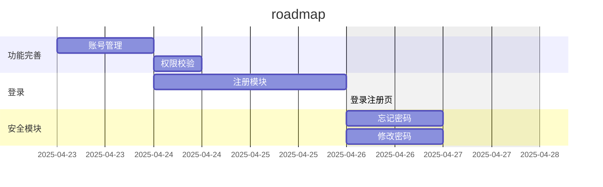

# Vastsea Token

## 简介

一站式认证鉴权服务

## 功能

- 登录
  - [ ] 登录页
  - [ ] 注册页
- 第三方客户端管理
  - [x] 注册第三方客户端
  - [x] 注销第三方客户端
  - [x] 修改第三方客户端信息
  - [x] 获取客户端列表
  - [x] 获取某个第三方客户端信息
- 账号管理
  - [x] 登录不同的客户端 (OAuth2, 授权码模式) (尚未测试, 等待客户端API实现)
  - [x] 停用账号
  - [x] 创建账号
    - [ ] 绑定角色 (前端与后端)
  - [ ] 修改账号
    - [ ] 绑定角色 (前端与后端)
  - [ ] online 接口 (账号是否在线)
- 安全模块
  - [ ] 忘记密码
  - [ ] 修改密码
- 角色管理
  - [x] 角色继承
  - [x] 角色删除
- 权限管理
  - [x] 权限创建
  - [x] 权限删除
  - [x] 权限修改
  - [x] 获取权限列表
  - [x] 获取某个权限信息
  - [x] 权限绑定
  - [ ] 权限校验 (客户端级别)

## ROADMAP

